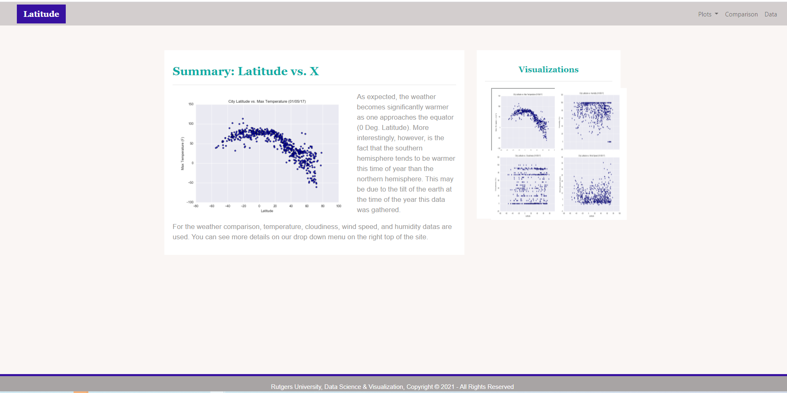

# Web Design Homework - Web Visualization Dashboard 
Data is more powerful when we share it with others! Let's see what I've learned about HTML and CSS to create a dashboard showing off the analysis I've done.

## Landing page

Bootstrap css was referred and style css file has been created to be used for each web page. 
Here is the first page view as below: 

* A landing page containing:
  * An explanation of the project.
  * Links to each visualizations page. There is a sidebar containing preview images of each plot, and clicking an image should take the user to that visualization.
* Four visualization pages, each with:
  * A descriptive title and heading tag.
  * The plot/visualization itself for the selected comparison.
  * A paragraph describing the plot and its significance.
* A comparison page that:
  * Contains all of the visualizations on the same page so we can easily visually compare them.
  * Uses a Bootstrap grid for the visualizations.
* A data page that:
  * Displays a responsive table containing the data used in the visualizations.
    * The table contains a bootstrap table component (table-responsive and table-striped). 
    * The data converted from the `.csv` file as HTML by using jupyter notebook. 
  

The website has all pages at the top of every page, have a navigation menu that:

* Has the name of the site on the left of the nav which allows users to return to the landing page from any page.
* Contains a dropdown menu on the right of the navbar named "Plots" that provides a link to each individual visualization page.
* Provides two more text links on the right: "Comparison," which links to the comparison page, and "Data," which links to the data page.
* Is responsive (using media queries). The nav has similar behavior such as changing color or moving the nav to the different view when the pages get smaller. 
Finally, the website must be deployed to GitHub pages.

When finished, submit to BootcampSpot the links to 1) the deployed app and 2) the GitHub repository.

Ensure your repository has regular commits (i.e. 20+ commits) and a thorough README.md file

### Screenshots

This section contains screenshots of each page.

#### Landing page

Large screen:

Small screen:

#### Max Temperature page

#### Humidity page

#### Cloudiness page

#### Wind Speed page

#### Comparison page

#### Data page

#### Navigation menu

Large screen:

Small screen:

## References

OpenWeatherMap.org. (2012). Сurrent weather and forecast. Retrieved from [https://openweathermap.org/](https://openweathermap.org/)